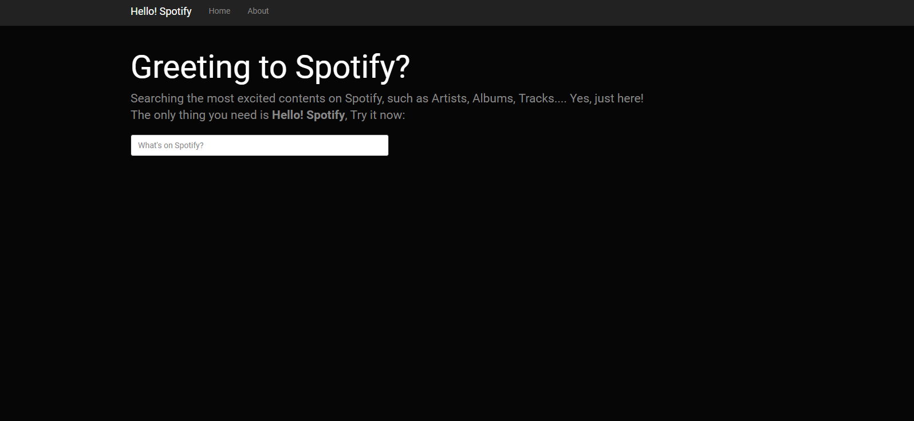
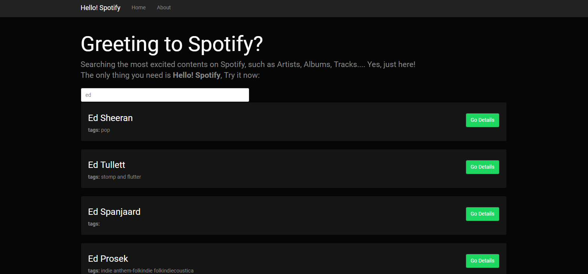
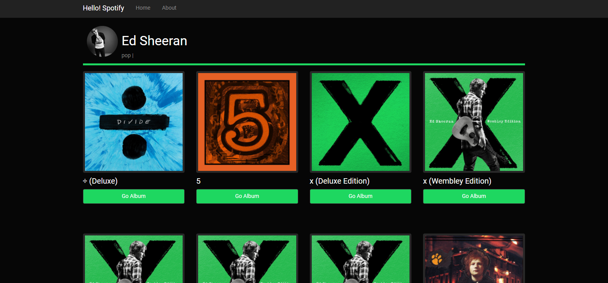
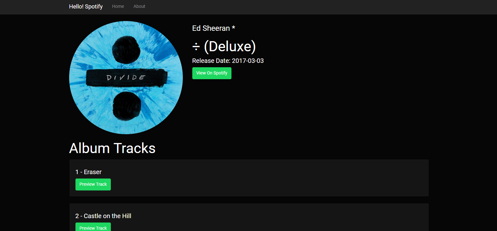

# Angular2 Practice Projects

This is a repo for my Angular2 exercise projects, following [Udemy Course: Learn Angular 2 Development By Building 12 Apps](https://www.udemy.com/learn-angular-2-development-by-building-10-apps).

All project do not contain node_modules folder! Please add such folder before running it.

Do not use this code for any business purpose.

## Content

### Project 1: Simple Angular2 Web App
- Understood the basic construct of Angular2 App
- Learned how to leverage some basic Angular2 features: Modules, Routers...

### Project 2: Color Previewer
This is a single component Angular app that shows user the color they input. Based on [Angular QuickStart](https://github.com/angular/quickstart).
css code credit: [Angular Academic](https://angular-academy.s3-us-west-1.amazonaws.com/styles/angular-academy-lessons-theme-v1.css).

#### Samples

### Project 3: Gihub Searcher
A useful tool for searching users in Github. You can get the information and repos from this user and links to these repos.

#### Samples
- Search Users

- Repositories List

## Note
This Repo contains only part of my project. It based on Angular framework and [Angular QuickStart](https://github.com/angular/quickstart), if you want to run the full project on your local machine, please also include neccessary dependecies and files ([node.js](https://nodejs.org/en/), etc.)

### Project 4: Spotify Searcher

A user-friendly searcher for any spotify content. You can search any artist name and explore their albums, tracks, you can even listen the trial by just one-click!

#### Sample

#### Landing Page

#### Searching

- Dynamically lists all matched artist.

#### Artist Page

#### Album Page

- Play the track trial by one-click
- Direct link to [Spotify](https://www.spotify.com)
