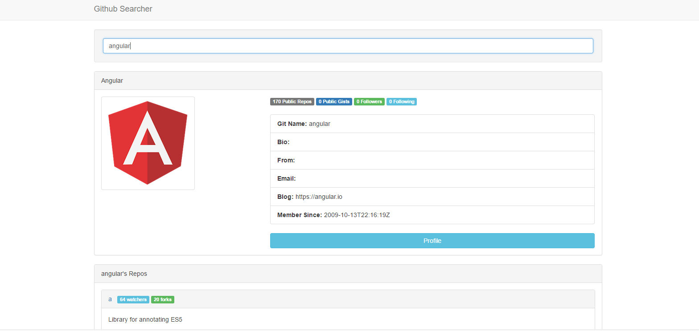
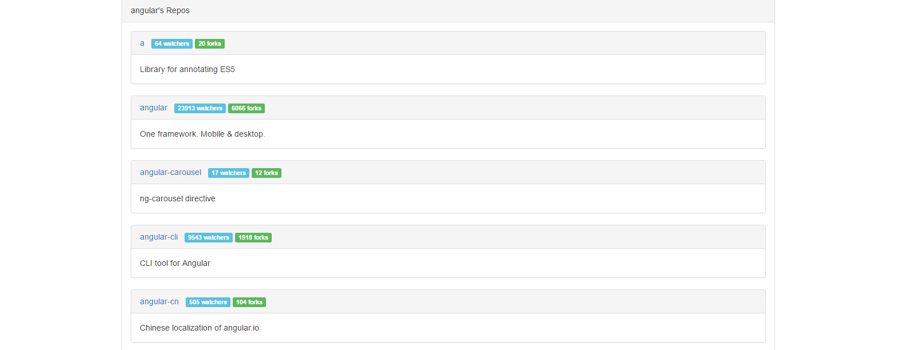

# Gihub Searcher
A useful tool for searching users in Github. You can get the information and repos from this user and links to these repos.

## Samples
### Search User Tempay

### Search User Angular

### Angular's Repositories List

## Note
This Repo contains only part of my project. It based on Angular framework and [Angular QuickStart](https://github.com/angular/quickstart), if you want to run the full project on your local machine, please also include neccessary dependecies and files ([node.js](https://nodejs.org/en/), etc.)
