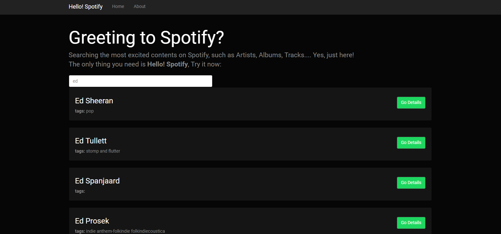

# Spotify Searcher

A user-friendly searcher for any spotify content. You can search any artist name and explore their albums, tracks, you can even listen the trial by just one-click!

## Sample

### Landing Page

### Searching

- Dynamically lists all matched artist.

### Artist Page

### Album Page

- Play the track trial by one-click
- Direct link to [Spotify](https://www.spotify.com)

## Note
This Repo contains only part of my project. It based on Angular framework and [Angular QuickStart](https://github.com/angular/quickstart), if you want to run the full project on your local machine, please also include neccessary dependecies and files ([node.js](https://nodejs.org/en/), etc.)
